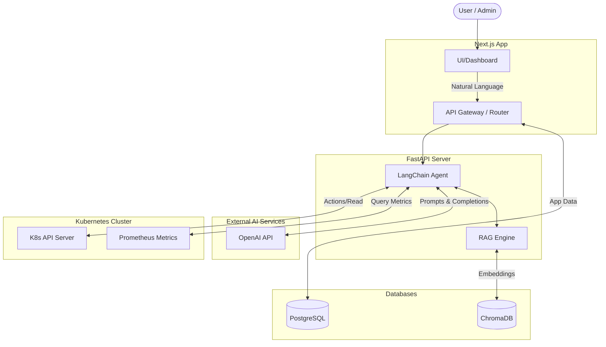

# KubeSage

KubeSage is an AI-Powered Kubernetes Intelligence Assistant designed to provide deep insights and operational intelligence for your Kubernetes clusters.

## Architecture

KubeSage is built with a modern, scalable architecture consisting of:



### Frontend
- **Framework**: Next.js 16 with React 19
- **Styling**: TailwindCSS 4
- **Language**: TypeScript
- **Icons**: Lucide React (ensure `lucide-react` is installed)

### Backend
- **Framework**: FastAPI (Python)
- **AI/ML Integration**: LangChain, OpenAI API, and ChromaDB for intelligent querying and retrieval-augmented generation.
- **Kubernetes Integration**: `kubernetes` python client for direct cluster interaction.
- **Metrics & Monitoring**: `prometheus-api-client` for fetching and analyzing cluster metrics.
- **Database**: PostgreSQL (managed via `psycopg2-binary` and `sqlalchemy`).

## Getting Started

### Prerequisites
- Node.js (v18+)
- Python (3.8+)
- PostgreSQL
- Kubernetes Cluster access (configured `kubeconfig`)
- OpenAI API Key

### Backend Setup
1. Navigate to the `backend` directory:
   ```bash
   cd backend
   ```
2. Create and activate a virtual environment:
   ```bash
   python -m venv venv
   # On Windows:
   .\venv\Scripts\activate
   # On macOS/Linux:
   source venv/bin/activate
   ```
3. Install dependencies:
   ```bash
   pip install -r requirements.txt
   ```
4. Run the API server:
   ```bash
   uvicorn main:app --reload
   ```

### Frontend Setup
1. Navigate to the `frontend` directory:
   ```bash
   cd frontend
   ```
2. Install dependencies:
   ```bash
   npm install
   npm install lucide-react # Resolves missing dependencies
   ```
3. Start the development server:
   ```bash
   npm run dev
   ```

## Features (In Development)
- **AI-Powered Diagnostics**: Ask natural language questions about your cluster's health and resources.
- **Metric Insights**: Integration with Prometheus to interpret performance metrics.
- **Kubernetes Management**: Direct interaction with the Kubernetes API to manage and monitor workloads.

## License
MIT License
